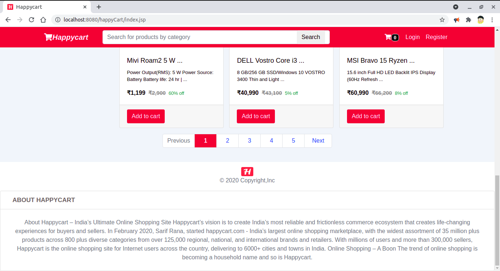

# Happycart-project

## [Happycart_project_demonstration-video](https://vimeo.com/614506482)

----------

##### This is an ecommerce project similar to other ecommerce site like flipkart,amazon...
* Here user can register themselves then add product to cart (also remove products from cart if he wants) and fill their billing address and then do checkout to get the product placed confirmation
* User can filter out products based on category or can search product by category name e.g. laptops, mobiles and so on....
* Admin can keep track of user, products and categories.. and also can add category as well as product for each category

-----------

 
 
 * you can find other screenshots in **Happycart-project/screenshots** folder

------------------------------
 
### Languages and technology used to build this project
* Java Servlets
* Java Server Page(JSP)
- Database language used
  - mysql (version: 8.0.21)
- Interaction with database done by
  - hibernate orm (version:5.4.21.Final)
- For styling purpose used 
  - html5
  - css3
  - bootstrap 4
  
 ---------------------------
 
### Steps to run this project
  1. download or clone this project
  2. unzip the file
  3. Open eclipse ide and import the project
  4. update the project
  5. run as server (Use should have apache server with you --- I used Apache Tomcat v8.5)
  
---------------------------------
* for sql data go to **Happycart-project/sql-data** folder
   sql data are saved in csv file... run a simple java program to add all data from csv file or you can pick data from csv file and fill 
   like that or use custom data.
   Admin email: **sarif@gmail.com** and password: **sarif**  
  
